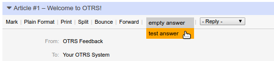

=====================================
 OTRS Package - Fast Reply
=====================================

This is a package for the ticket system OTRS_ 4.0

The answer field in the Views AgentTicketZoom and AgentTicketOverviewPreview will
be overlayed by a clickable list.

Originally the answer field is a select item. It contains an option list of answer
templates. When the list item is selected, a Java-Script opens a popup to send an answer.

Now an answer can be chosen by hovering over the answer button and choosing the template
with one click.

The package is released under AGPL_ Version 3 (See COPYING for more infos).

Authors:

* Marek Kralewski <mck(at)tuxwerk.de>

Download the opm:

http://opar.perl-services.de/dist/FastReply

Installation
------------

Install the opm file in OTRS. Create a GenericAgent job and add the Module: Kernel::System::GenericAgent::PurgeAttachments

.. _OTRS: http://www.otrs.org
.. _AGPL: http://www.gnu.org/licenses/agpl.txt
